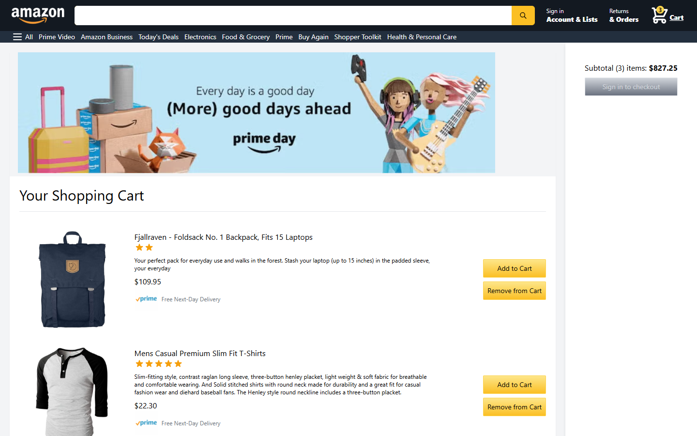
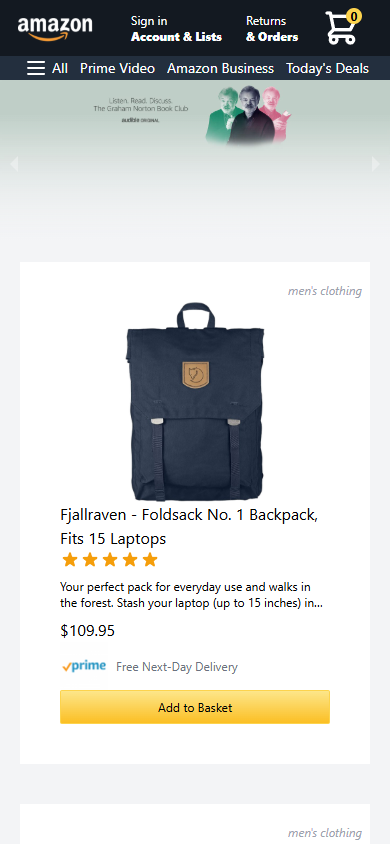

# My Amazon

A clone of the Amazon.com storefront and checkout flow, built with Next.js 12, React 17, Redux Toolkit, Tailwind CSS, NextAuth, and Firebase. Product data comes from the public [Fake Store API](https://fakestoreapi.com/).

## Screenshots

| Home | Checkout |
| --- | --- |
|  |  |



## Features

- **Home page** — header/nav, promo banner carousel (`react-responsive-carousel`), and a product feed fetched server-side (`getServerSideProps`) from Fake Store API.
- **Shopping basket** — global Redux store (`@reduxjs/toolkit`) with `addToBasket` / `removeFromBasket` actions and a live item-count badge in the header.
- **Checkout page** — lists basket items with quantity/subtotal and a "Remove from Cart" action per item.
- **Google sign-in** — authentication via `next-auth` (`GoogleProvider`); the checkout button is disabled until the user is signed in.
- **Firebase** — `firebase.js` initializes an app instance with Analytics (not otherwise wired into the UI).

## Tech stack

| Layer      | Library                                    |
| ---------- | ------------------------------------------ |
| Framework  | Next.js 12 (Pages Router)                  |
| UI         | React 17, Tailwind CSS 2                   |
| State      | Redux Toolkit / React-Redux                |
| Auth       | NextAuth 4 (Google OAuth)                  |
| Data       | Fake Store API (products), Firebase (SDK)  |
| Icons      | Heroicons                                  |

## Getting started

### Prerequisites

- Node.js 16 or 18 (the project pins `next-auth@4.15.1`, which does not officially support Node 20+/22+; it still runs on newer Node versions with warnings)
- npm or Yarn

### Install

```bash
npm install --legacy-peer-deps
```

`--legacy-peer-deps` is required: `react@17.0.1` is older than the peer range Next.js 12.1.2 declares (`^17.0.2 || ^18.0.0-0`), so a plain `npm install` fails with an `ERESOLVE` error. Installing with Yarn (`yarn`) does not have this problem, since Yarn only warns on peer mismatches.

### Configure environment variables

Google sign-in needs OAuth credentials from the [Google Cloud Console](https://console.cloud.google.com/apis/credentials). Create a `.env.local` file in the project root:

```bash
GOOGLE_ID=your-google-oauth-client-id
GOOGLE_SECRET=your-google-oauth-client-secret
```

Without these, the app still runs and the storefront/basket work normally, but clicking "Sign in with Google" fails (see Known issues).

### Run

```bash
npm run dev
```

Open [http://localhost:3000](http://localhost:3000).

Other scripts: `npm run build` (production build) and `npm run start` (serve the production build).

## Known issues

Verified by running the app locally:

- **Sign-in is not configured out of the box.** `GOOGLE_ID` / `GOOGLE_SECRET` aren't set anywhere in the repo (no `.env.example`), so "Sign in with Google" fails until you supply your own OAuth credentials.
- **Checkout doesn't process payment.** The "Proceed to checkout" button has no `onClick` handler — it becomes enabled once signed in, but nothing happens when clicked. There's no payment integration (e.g. Stripe) wired up.
- **Hardcoded secrets in source.** `firebase.js` contains a live Firebase client config, and `src/pages/api/auth/[...nextauth].js` hardcodes the NextAuth `secret` string. Firebase client keys are meant to be public, but the NextAuth secret should be moved to an environment variable.
- **`npm install` needs `--legacy-peer-deps`** due to the React/Next version mismatch described above.

Everything else — browsing products, the banner carousel, adding/removing basket items, the live cart badge, and viewing the cart on the checkout page — works as expected.

## Project structure

```
src/
  app/store.js              Redux store setup
  components/                UI components (Header, Banner, Product, ProductFeed, CheckoutProduct, ...)
  pages/
    index.js                 Home page
    checkout.js               Checkout / cart page
    api/auth/[...nextauth].js NextAuth configuration
  slices/basketSlice.js       Redux slice for the basket
  styles/globals.css          Tailwind base styles
firebase.js                   Firebase app initialization
```
